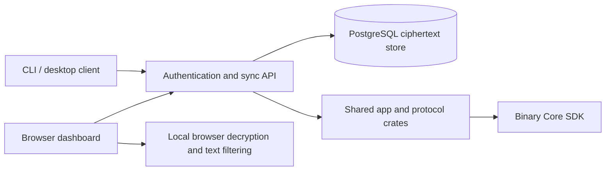

# Respire Server

Respire Server provides authentication and encrypted cross-device synchronization backed by PostgreSQL. The cloud stores ciphertext and does not decrypt memories. The browser dashboard decrypts data locally after the user unlocks it.



## Repository layout

| Directory | Responsibility |
|---|---|
| `service/` | Rust API, authentication, ciphertext storage, OpenAPI contract and sync checks |
| `admin-ui/` | React administrator console at `/admin` and user dashboard at `/dashboard` |
| `deploy/` | Example reverse proxy, web image, Compose configuration and database backup script |
| `sdk/`, `scripts/` | Pinned binary SDK metadata, checksum verification and runtime/notice staging |

## Build and test

Use Rust 1.95.0, Node.js and an SDK matching the target and the SHA-256 lock. Use a target present in `sdk/core-sdk.lock.json` and provide its matching SDK.

```bash
git clone https://github.com/risense-ai/respire-server.git
cd respire-server
export RESPIRE_CORE_SDK_DIR=/path/to/validated-sdk
node scripts/fetch-core-sdk.mjs x86_64-pc-windows-msvc
cargo check --workspace --locked
```

For PostgreSQL integration tests, set `DATABASE_URL` to an isolated test instance whose user can create databases. Existing tests create databases named `t<uuid>`. Enable the explicit test provider with `RESPIRE_CORE_TEST_MODE=1` and run `cargo test --locked -p respire_service -- --test-threads=1`. No model download is needed for these tests.

Build the browser console with `cd admin-ui && npm ci && npm test && npm run build`. Hash routes include `/admin#/users` and `/dashboard#/memories`. Browser search filters decrypted title, body, type, project and tags by text; semantic retrieval belongs to Core in the native application.

## Production endpoints

| Host | Surface | Production upstream |
|---|---|---|
| `https://rsrs.rs` | Website | Web image on `127.0.0.1:18089` |
| `https://dash.rsrs.rs` | User dashboard | Web console; same-origin user API proxy |
| `https://admin.rsrs.rs` | Administrator console | Web console; existing administrator authorization |
| `https://api.rsrs.rs` | HTTP API | Server on `127.0.0.1:18789` |

The dashboard hostname rejects `/admin` routes. Console API requests remain same-origin through nginx; API clients use `api.rsrs.rs`. Local development uses API port 8787 and web port 8087. Only an explicitly selected production deployment can synchronize the four-host nginx configuration. No DNS, certificate or deployment changes are made by editing these templates.

## Deployment

| Component | Configuration | Default local endpoint |
|---|---|---|
| API + database | `compose.yaml`, `.env.example` | `127.0.0.1:8787` |
| Separate web console | `deploy/compose-web.yaml` | `127.0.0.1:8087` |
| Test database | `compose.postgres.yml` | Explicit `POSTGRES_BIND` and port |

Copy `.env.example` to `.env`, supply a random database password and select a validated image version. `service/Dockerfile` needs a validated Linux GNU SDK, so its build fails clearly while that target is absent from the lock. SDK runtime libraries and third-party notices are staged with the executable.

Run the manual `Deployment artifact` workflow after CI succeeds for the exact server and website revisions. Download its image archive, Compose files, deployment script and checksums, then use an operator SSH session to deploy the verified artifact with `deploy/ssh-deploy.sh` to a prepared instance. Configure domains, certificate paths and environment directories for your installation. API and static web images deploy independently; `/admin/` JSON routes go to the API, while `/admin` and `/dashboard` serve the SPA.

`deploy/backup-prod.sh` takes and verifies a PostgreSQL dump, retaining seven backups. Configure its paths for your installation. Preserve the PostgreSQL volume during image upgrades; `docker compose down -v` deletes it. Deployment is manual. After the exact revision passes CI and image smoke checks, a push to `main` publishes a unique `<version>-dev.<run-id>` image and updates the `dev` channel. A `v<version>` tag matching `service/Cargo.toml` publishes the stable version and updates `latest`. Both also publish an immutable source-SHA tag. Manual image validation does not publish unless `publish_image` is explicitly selected on a matching version tag.

## Transactional email

Configure `RESPIRE_SMTP_HOST`, `RESPIRE_SMTP_USERNAME`, `RESPIRE_SMTP_PASSWORD` and
`RESPIRE_MAIL_FROM` through the deployment environment. `RESPIRE_SMTP_PORT` defaults
to 587 with mandatory STARTTLS; 465 uses implicit TLS. Use the authenticated mailbox
as the sender unless the provider explicitly permits aliases. Never commit passwords.

Verification requests save the code and `mail_outbox` row in one transaction and
return `queued`, not a delivery confirmation. A separate worker sends email without
holding an HTTP database connection, retries up to three attempts and stops when
the code expires or is superseded. Requests have a 60-second per-account cooldown.
Delivery attempts are separated by at least ten seconds (at most 360/hour); reserve
provider capacity if this mailbox is also used elsewhere.

Schema version 4 marks historical outbox rows as `legacy` and clears their bodies;
they are never sent. Administrator APIs expose delivery metadata, not verification
codes. Successfully sent, expired and failed messages also have their bodies cleared.
SMTP acceptance is not proof of inbox delivery. A crash after SMTP acceptance but
before the database acknowledgement can produce a duplicate email on retry.
Without SMTP settings the worker is disabled; queued codes still expire normally.

Binding marks an address as verified only after a valid code is confirmed. Administrator
changes clear that flag. Codes expire after ten minutes and are invalidated after five
incorrect binding attempts; requests are limited to once per minute.

Password recovery uses the verified address bound to the username. Unknown, unverified,
disabled and deleted accounts receive the same acknowledgement without sending mail.
Reset codes expire in ten minutes and allow five incorrect attempts. A successful
reset atomically consumes the code, changes only the login credentials, and revokes
existing sessions and pending login tickets. Memory ciphertext, vault keys and TOTP
enrollment remain unchanged. Sign in again with the new password.

The existing browser development smoke check now verifies actual mail receipt.
Set `RESPIRE_DEV_MAIL_ADDRESS` to an isolated test mailbox and `RESPIRE_DEV_MAIL_READER`
to a JSON command array (for example `["python3", "../scripts/read-dev-mail.py"]` when
running from `admin-ui`). The included reader uses `RESPIRE_DEV_IMAP_HOST`,
`RESPIRE_DEV_IMAP_USERNAME` and `RESPIRE_DEV_IMAP_PASSWORD` over TLS on port 993.
The runner appends one JSON argument containing `recipient`, `requestedAt` and `purpose`.
The reader must search that mailbox for the requested message after `requestedAt`
and output `{"code":"123456"}`, or `{"code":null}` while waiting. Supply mailbox
credentials through the reader's environment, never its arguments. Tests no longer
retrieve codes from administrator APIs. Do not run concurrent smoke jobs against the same mailbox.

## Build dependencies

The server pins the `respire_app` crate from `risense-ai/respire-cli`. Builds need access to that revision and a matching Core SDK. The web image uses `respire-site`. Keep dependency credentials out of images and Git. The memory CLI command is `rsrs`; the service executable is `respire-server`.

## Contributing

Use English code comments and the UI translation catalog for visible text. Do not add Rust `.unwrap()` or `.expect()` calls. Keep `.env`, credentials, database dumps and SDK artifacts out of Git. CI retains PostgreSQL integration tests and the existing coverage gate; Core source credentials are not needed.
