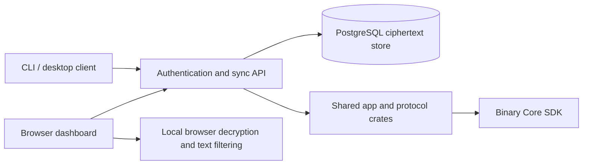

# Respire Server

Respire Server provides authentication and encrypted cross-device synchronization backed by PostgreSQL. The cloud stores ciphertext and does not decrypt memories. The browser dashboard decrypts data locally after the user unlocks it.



## Repository layout

| Directory | Responsibility |
|---|---|
| `service/` | Rust API, authentication, ciphertext storage, OpenAPI contract and sync checks |
| `deploy/` | API-only artifact deployment, legacy proxy reference and database backup tooling |
| `sdk/`, `scripts/` | Pinned binary SDK metadata, checksum verification and runtime/notice staging |

## Build and test

Use Rust 1.95.0, Node.js and an SDK matching the target and the SHA-256 lock. Use a target present in `sdk/core-sdk.lock.json` and provide its matching SDK.

```bash
git clone https://github.com/risense-ai/respire-server.git
cd respire-server
export RSRS_CORE_SDK_DIR=/path/to/validated-sdk
node scripts/fetch-core-sdk.mjs x86_64-pc-windows-msvc
cargo check --workspace --locked
```

For PostgreSQL integration tests, set `DATABASE_URL` to an isolated test instance whose user can create databases. Existing tests create databases named `t<uuid>`. Enable the explicit test provider with `RSRS_CORE_TEST_MODE=1` and run `cargo test --locked -p respire_service -- --test-threads=1`. No model download is needed for these tests.

All frontend source, browser tests and builds live in [respire-site](https://github.com/risense-ai/respire-site): homepage, Dashboard and Admin. This repository contains API processes only. Cloud browser requests use the explicit HTTPS API base and bearer tokens; see the [producer browser contract](docs/browser-api-contract.md). Browser search filters decrypted text; semantic retrieval remains local to Core.

The cloud `serve` command does not initialize a model or decrypt memories. The
independent loopback `access` command is a local infrastructure host: it resolves
the selected library database, reads model files and supplies authorized memory
records and model bytes to Core through the app SDK. Core performs inference and
private memory policies in memory; it does not open files, databases or directories.
Opaque derived index bytes are interpreted by Core and persisted by the host.

## Endpoint ownership and staged deployment

Admin daily operations statistics use schema 7 and owner/admin-only
`GET /admin/stats?days=30`. Memory totals start at first server receipt after
tracking is enabled; editing or deleting records never rewrites historical totals.
Earlier memory counts are unknown, while historical registrations and sessions
cover records retained at upgrade. See the [producer browser contract](docs/browser-api-contract.md).

| Host | Owner | Target surface |
|---|---|---|
| `https://rsrs.rs` | `respire-site` | Homepage |
| `https://dash.rsrs.rs` | `respire-site` | Dashboard Pages app |
| `https://admin.rsrs.rs` | `respire-site` | Admin Pages app |
| `https://api.rsrs.rs` | `respire-server` | Authentication, admin and ciphertext APIs |

These are the intended source/deployment boundaries, not proof of live DNS,
proxy or account configuration. Deploy the API first, then Dashboard and Admin
Pages, then migrate traffic. The old same-origin UI continues working during
this sequence. `deploy/nginx-api.conf.example` is a generic template; substitute
your own domain, certificate paths and upstream port in private host configuration.

Copy `.env.example` to `.env`, provide a random PostgreSQL password and select a
validated API image. Set `RSRS_CORS_ALLOWED_ORIGINS` to the exact trusted browser
origins before Pages acceptance. It is empty by default. Cloud CORS supports
`GET`, `POST`, `Authorization` and `Content-Type`; it does not enable cookies or
change bearer/role authorization. See [configuration and acceptance](docs/browser-api-contract.md).

Set `RSRS_DASHBOARD_URL` to the Dashboard for the selected API environment
before starting the API. For DEV, set `RSRS_DASHBOARD_URL=https://dash.dev.rsrs.rs`
in the private `.env` or `deployment.env`; production uses `https://dash.rsrs.rs`.
The generic example and Compose fallback are production values, so a DEV setup
must override them. Verify that `/oauth/device/code` returns a verification link
on the selected Dashboard before accepting CLI/TUI login.

Use the manual **API deployment artifact** workflow after Server CI and Server
image succeed for the exact source revision. It packages only the API image and
API deployment files. [API deployment and rollback](docs/api-deployment.md) preserve
the existing PostgreSQL database and already-running legacy web containers,
images, environment files and routes. Frontend source removal does not retire
that runtime. Keep rollback images/configuration before migration; do not prune
them until the verified cutover and rollback window have completed.

`deploy/backup-database.sh` takes and verifies PostgreSQL dumps, retaining seven
backups. Pass the installation directory, Compose project and backup directory
explicitly. Never use `docker compose down -v`
on a database that must be preserved. Builds still need the checksum-pinned Core
SDK; Node remains a backend build dependency for SDK download/staging.

Database/API deployment uses SSH from the operator's own computer; GitHub runners
only check and build code. Keep actual installation and secret configuration
outside public source, CI logs and artifacts. Cloudflare Pages frontend deployment
uses its separate GitHub integration. After exact-revision CI and image smoke checks pass,
a push to `main` publishes `<version>-dev.<run-id>`, `dev`, and an immutable
source-SHA image. A matching `v<version>` tag publishes the stable version and
`latest`. Manual image validation publishes only when `publish_image` is
explicitly selected on a matching version tag. A PR does not deploy anything.

## Retired legacy local console

The historical `respire-server web` command and its private console API on port
8788 are removed. The frontend lives on neither Server nor Pages. This does not
remove any local profile, database or key file, the current native CLI/runtime or
desktop UI, or the independent bearer-scoped `respire-server access` read-only API.
Only homepage, Dashboard and Admin frontend source remain in `respire-site`.

## Transactional email

Configure `RSRS_SMTP_HOST`, `RSRS_SMTP_USERNAME`, `RSRS_SMTP_PASSWORD` and
`RSRS_MAIL_FROM` through the deployment environment. `RSRS_SMTP_PORT` defaults
to 587 with mandatory STARTTLS; 465 uses implicit TLS. Use the authenticated mailbox
as the sender unless the provider explicitly permits aliases. Never commit passwords.

Verification requests save the code and `mail_outbox` row in one transaction and
return `queued`, not a delivery confirmation. A separate worker sends email without
holding an HTTP database connection, retries up to three attempts and stops when
the code expires or is superseded. Requests have a 60-second per-account cooldown.
Delivery attempts are separated by at least ten seconds (at most 360/hour); reserve
provider capacity if this mailbox is also used elsewhere.

Schema version 4 marks historical outbox rows as `legacy` and clears their bodies;
they are never sent. Administrator APIs expose delivery metadata, not verification
codes. Successfully sent, expired and failed messages also have their bodies cleared.
SMTP acceptance is not proof of inbox delivery. A crash after SMTP acceptance but
before the database acknowledgement can produce a duplicate email on retry.
Without SMTP settings the worker is disabled; queued codes still expire normally.

Binding marks an address as verified only after a valid code is confirmed. Administrator
changes clear that flag. Codes expire after ten minutes and are invalidated after five
incorrect binding attempts; requests are limited to once per minute.

Password recovery uses the verified address bound to the username. Unknown, unverified,
disabled and deleted accounts receive the same acknowledgement without sending mail.
Reset codes expire in ten minutes and allow five incorrect attempts. A successful
reset atomically consumes the code, changes only the login credentials, and revokes
existing sessions and pending login tickets. Memory ciphertext, vault keys and TOTP
enrollment remain unchanged. Sign in again with the new password.

Frontend builds and browser/hosted acceptance belong to `respire-site`. CLI releases
retain CLI/API validation and exact source-SHA gates without depending on frontend
checkout, console/homepage SHAs or browser tests; see the coordinated
[CLI cleanup](https://github.com/risense-ai/respire-cli/pull/19).
Browser acceptance harnesses moved with their frontend to `respire-site`. The
backend `scripts/read-dev-mail.py` helper remains available at its existing path
for external mail-acceptance consumers. Run mailbox checks only with isolated
test identities and an explicitly configured test mailbox. Unit/contract fixtures
do not verify production SMTP delivery.

## Build dependencies

The server pins the `respire_app` crate from `risense-ai/respire-cli`. Builds need access to that revision and a matching Core SDK. Keep dependency credentials out of images and Git. The memory CLI command is `rsrs`; the service executable is `respire-server`.

## Contributing

Use English code comments. Frontend translation catalogs live in `respire-site`. Do not add Rust `.unwrap()` or `.expect()` calls. Keep `.env`, credentials, database dumps and SDK artifacts out of Git. CI retains PostgreSQL integration tests and the existing coverage gate; Core source credentials are not needed.

## License

First-party material uses the [Respire Noncommercial License 1.0](LICENSE).
Personal noncommercial use and self-hosting are permitted. Commercial use,
including internal business deployment, requires prior written authorization.
See [commercial licensing](COMMERCIAL-LICENSE.md).
